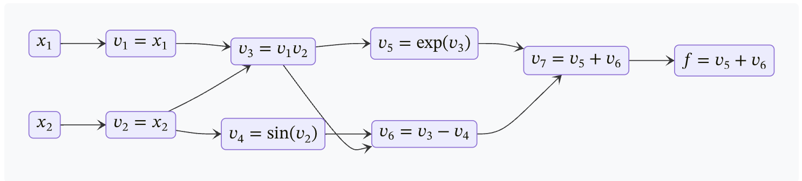

# Training neural networks

**Vikas Chandrakant Raykar**
Microsoft AI

---

# Collateral


notes - https://vikasraykar.github.io/deeplearning
code  - https://github.com/vikasraykar/deeplearning-dojo


---

# Training neural networks

The goal of training is to find the value of the **parameters** of a neural network **model** to make **effective predictions**.

---

# Training neural networks

We choose the **model parameters** by **optimizing** a **loss function**.

- Model and parameters
- Loss function
- Gradient Descent
- Optimizers
- Backpropagation and Automatic differenciation
- Normalization
- Training loop
- Quiz and coding exercises

---

# Training neural networks

- **Model and parameters**
- **Loss function**
- Gradient Descent
- Optimizers
- Backpropagation and Automatic differenciation
- Normalization
- Training loop
- Quiz and coding exercises

---

# Single Layer Networks

For simplicity we will mainly discuss single layer networks for regression and classification.


---

# Linear Regression
Linear Regression is a single layer neural network for regression.

The probability of $y$ for a given feature vector ($\mathbf{x}\in \mathbb{R}^d$) is modelled as
$$
\text{Pr}[y|\mathbf{x},\mathbf{w}] = \mathcal{N}(y|\mathbf{w}^T\mathbf{x},\sigma^2)
$$
where $\mathbf{w}\in \mathbb{R}^d$ are the weights/**parameters** of the model and $\mathcal{N}$ is the **normal** distribution with mean $\mathbf{w}^T\mathbf{x}$ and variance $\sigma^2$.

The prediction is given by
$$
\text{E}[y|\mathbf{x},\mathbf{w}] = \mathbf{w}^T\mathbf{x}
$$

> Without loss of generalization we ignore the bias term as it can be incorporated into the feature vector.

---

# Negative log likelihood

Given a dataset $\mathcal{D}=\{\mathbf{x}_i \in \mathbb{R}^d,\mathbf{y}_i \in \mathbb{R}\}_{i=1}^N$ containing $n$ examples we need to estimate the parameter vector $\mathbf{w}$ by maximizing the likelihood of data.

> In practice we minimize the **negative log likelihood**.

Let $\mu_i = \mathbf{w}^T\mathbf{x}_i$ be the model prediction for each example in the training dataset.

The negative log likelihood (NLL) is given by
$$
L(\mathbf{w}) = - \sum_{i=1}^{N} \log \left[\text{Pr}[y_i|\mathbf{x}_i,\mathbf{w}]\right] = \frac{N}{2} \log(2\pi\sigma^2) + \frac{1}{2\sigma^2} \sum_{i=1}^{N} (y_i-\mu_i)^2 \nonumber \\
$$

---

# Mean Squared Error loss

This is equivalent to minimizing the **Mean Squared Error** (MSE) loss.
$$
L(\mathbf{w}) = \frac{1}{N} \sum_{i=1}^{N} (y_i-\mu_i)^2
$$
We need to choose the model parameters that optimizes (minimizes) the loss function.
$$
\hat{\mathbf{w}} = \arg \min_{\mathbf{w}} L(\mathbf{w})
$$

[`torch.nn.MSELoss`](https://pytorch.org/docs/stable/generated/torch.nn.MSELoss.html#torch.nn.MSELoss)

---

# Logistic Regression
Logistic Regression is a single layer neural network for binary classification.

The probability of the positive class ($y=1$) for a given feature vector ($\mathbf{x}\in \mathbb{R}^d$) is given by
$$
\text{Pr}[y=1|\mathbf{x},\mathbf{w}] = \sigma(\mathbf{w}^T\mathbf{x})
$$
where $\mathbf{w}\in \mathbb{R}^d$ are the weights/**parameters** of the model and $\sigma$ is the **sigmoid** activation function defined as
$$
\sigma(z) = \frac{1}{1-e^{-z}}
$$

> Without loss of generalization we ignore the bias term as it can be incorporated into the feature vector.


---

# Negative log likelihood

Given a dataset $\mathcal{D}=\{\mathbf{x}_i \in \mathbb{R}^d,\mathbf{y}_i \in [0,1]\}_{i=1}^N$ containing $n$ examples we need to estimate the parameter vector $\mathbf{w}$ by maximizing the likelihood of data.

> In practice we minimize the **negative log likelihood**.

Let $\mu_i = \text{Pr}[y_i=1|\mathbf{x}_i,\mathbf{w}] = \sigma(\mathbf{w}^T\mathbf{x}_i)$ be the model prediction for each example in the training dataset.

The the negative log likelihood (NLL) is given by
$$
L(\mathbf{w}) = - \sum_{i=1}^{N} \log\left[\mu_i^{y_i}(1-\mu_i)^{1-y_i}\right] \nonumber = - \sum_{i=1}^{N} \left[ y_i\log(\mu_i) + (1-y_i)\log(1-\mu_i) \right]
$$

---

# Binary cross entropy loss

This is referred to as the **Binary Cross Entropy** (BCE) loss.

$$
L(\mathbf{w}) = - \sum_{i=1}^{N} \left[ y_i\log(\mu_i) + (1-y_i)\log(1-\mu_i) \right]
$$

We need to choose the model parameters that optimizes (minimizes) the loss function.
$$
\hat{\mathbf{w}} = \arg \min_{\mathbf{w}} L(\mathbf{w})
$$

[`torch.nn.BCELoss`](https://pytorch.org/docs/stable/generated/torch.nn.BCELoss.html#torch.nn.BCELoss)
[`torch.nn.BCEWithLogitsLoss`](https://pytorch.org/docs/stable/generated/torch.nn.BCEWithLogitsLoss.html#torch.nn.BCEWithLogitsLoss)

---

# Summary

|   | Linear Regression | Logistic Regression |
| :- | :- |  :- |
| Model | $\mu=\mathbf{w}^T\mathbf{x}$ | $\mu = \sigma(\mathbf{w}^T\mathbf{x})$
| Parameters | $\mathbf{w}\in\mathbb{R}^{d+1}$ | $\mathbf{w}\in\mathbb{R}^{d+1}$
| Loss function $L(\mathbf{w})$ | MSE $\frac{1}{N} \sum_{i=1}^{N} (y_i-\mu_i)^2$ | BCE $- \sum_{i=1}^{N} \left[ y_i\log(\mu_i) + (1-y_i)\log(1-\mu_i) \right]$

[Pytorch loss fucnctions](https://pytorch.org/docs/stable/nn.html#loss-functions)

---

<style scoped>section{font-size:20px;}</style>

# Training neural networks

- **Model and parameters**
  - Single layer neural networks
  - Linear Regression
  - Logistic Regression
- **Loss function**
  - Mean Squared Error loss
  - Binary Cross Entroy loss
- **Gradient Descent**
- Optimizers
- Backpropagation and Automatic differenciation
- Normalization
- Training loop
- Quiz and coding exercises

---

# Parameter estimation

Let $\mathbf{w}$ be a vector of all the parameters for a model.

Let $L(\mathbf{w})$ be the loss function (or error function).

We need to choose the model parameters that optimizes (minimizes) the loss function.

$$
\hat{\mathbf{w}} = \arg \min_{\mathbf{w}} L(\mathbf{w})
$$

We will do this via **gradient descent**.

---

# Gradient Descent

> Steepest descent.

Let $\nabla L(\mathbf{w})$ be the **gradient vector**, where each element is the partial derivative of the loss fucntion wrt each parameter.

The gradient vector points in the **direction of the greatest rate of increase of the loss function**.

So to mimimize the loss function we take small steps in the direction of $-\nabla L(\mathbf{w})$.

At the mimimum $\nabla L(\mathbf{w})=0$.

---

# Stationary points

$\nabla L(\mathbf{w})=0$ are knows as stationary points, which can be either be
- minima (local or global)
- maxima (local or global)
- saddle point

The necessary and sufficient condition for a local minima is
1. The gradient of the loss function should be zero.
1. The Hessian matrix should be positive definite.

---

# Gradient descent

- Batch Gradient Descent
- Stochastic Gradient Descent
- Min-batch Stochastic Gradient Descent

> For now we will assume the gradient is given. For deep neural networks the gradient can be computed efficiently via **backpropagation**(which we will revisit later).

---

# Batch Gradient Descent

We take a small step in the direction of the **negative gradient**.

$$
\mathbf{w}^t \leftarrow \mathbf{w}^{t-1} - \eta \nabla L(\mathbf{w}^{t-1})
$$

The parameter $\eta > 0$ is called the **learning rate** and determines the step size at each iteration. This update is repeated multiple times (till covergence).
```python
for epoch in range(n_epochs):
  dw = gradient(loss, data, w)
  w = w - lr * dw
```

> Each step requires that the **entire training data** be processed to compute the gradient $\nabla L(\mathbf{w}^{t-1})$. For large datasets this is not comptationally efficient.

---

# Stochastic Gradient Descent

In general most loss functions can be written as sum over each training instance.
$$
L(\mathbf{w}) = \sum_{i=1}^{N} L_i(\mathbf{w})
$$

In Stochastic Gradient Descent (SGD) we update the parameters **one data point at a time**.
$$
\mathbf{w}^t \leftarrow \mathbf{w}^{t-1} - \eta \nabla L_i(\mathbf{w}^{t-1})
$$

> A complete passthrough of the whole dataset is called an **epoch**.

```python
for epoch in range(n_epochs):
  for i in range(n_data):
    dw = gradient(loss, data[i], w)
    w = w - lr * dw
```

---

# Stochastic Gradient Descent

- SGD is much faster and more computationally efficient, but it has noise in the estimation of the gradient.
- Since it updates the weight frequently, it can lead to big oscillations and that makes the training process highly unstable.


> Bottou, L. (2010). [Large-Scale Machine Learning with Stochastic Gradient Descent](https://leon.bottou.org/publications/pdf/compstat-2010.pdf). In: Lechevallier, Y., Saporta, G. (eds) Proceedings of COMPSTAT'2010. Physica-Verlag HD.

---

# Mini-batch Stochastic Gradient Descent

Using a single example results in a very noisy estimate of the gradient.

So we use a small random subset of data called **mini-batch** of size B (**batch size**) to compute the gradient.

$$
\mathbf{w}^t \leftarrow \mathbf{w}^{t-1} - \eta \nabla L_{batch}(\mathbf{w}^{t-1})
$$

```python
for epoch in range(n_epochs):
  for mini_batch in get_batches(data, batch_size):
    dw = gradient(loss, mini_batch, w)
    w = w - lr * dw
```
---

# Mini-batch Stochastic Gradient Descent

Mini-batch SGD is the most commonly used method and is sometimes refered to as just SGD.
- Typical choices of the batch size are B=32,64,128,256,..
- In practice we do a random shuffle of the data per epoch.

> In practice, mini-batch SGD is the most frequently used variation because it is both computationally cheap and results in more robust convergence.

[`torch.optim.SGD`]("https://pytorch.org/docs/stable/generated/torch.optim.SGD.html#torch.optim.SGD")

```python
optimizer = optim.SGD(model.parameters(), lr=1e-3)
```

---

<style scoped>section{font-size:20px;}</style>

# Training neural networks

- **Model and parameters**
  - Single layer neural networks
  - Linear Regression
  - Logistic Regression
- **Loss function**
  - Mean Squared Error loss
  - Binary Cross Entroy loss
- **Gradient Descent**
  - Batch Gradient Descent
  - Stochastic Gradient Descent
  - Mini-batch Stochastic Gradient Descent
- **Optimizers**
- Backpropagation and Automatic differenciation
- Normalization
- Training loop

---


# Optimizers

Improvements over min-batch stochastic gradient descent for **faster convergence** and **stability**.

- Adding momentum.
- Adaptive learning rates.
  - Adagrad
  - RMSProp
  - Adam

---
# Adding momentum
One of the basic improvements over SGD comes from adding a **momentum** term.

At every time step, we update **velocity** by decaying the previous velocity by a factor of $0 \leq \mu \leq 1$ (called the **momentum** parameter) and adding the current gradient update.
$$
\mathbf{v}^{t-1} \leftarrow \mu \mathbf{v}^{t-2} - \eta \nabla L(\mathbf{w}^{t-1})
$$
Then, we update our weights in the direction of the velocity vector.
$$
\mathbf{w}^t \leftarrow \mathbf{w}^{t-1} + \mathbf{v}^{t-1}
$$

```python
for epoch in range(n_epochs):
  for mini_batch in get_batches(data, batch_size):
    dw = gradient(loss, mini_batch, w) # gradient
    v = momentum * v - lr * dw # velocity
    w = w + v
```

---
# Adding momentum

We now have two hyper-parameters **learning rate** and **momentum**.

Typically we set the momentum parameter to 0.9.

One interpretation of momentum to increase the effective learning rate from $\eta$ to $\frac{\eta}{(1-\mu)}$.

[`torch.optim.SGD`](https://pytorch.org/docs/stable/generated/torch.optim.SGD.html#torch.optim.SGD)

```python
optimizer = optim.SGD(model.parameters(), lr=0.01, momentum=0.9)
```
---

# Adding momentum

- We can now escape local minima or saddle points because we keep moving downwards even though the gradient of the mini-batch might be zero.
- Momentum can also help us reduce the oscillation of the gradients because the velocity vectors can smooth out these highly changing landscapes.
- It reduces the noise of the gradients and follows a more direct walk down the landscape.


> Ilya Sutskever, James Martens, George Dahl, and Geoffrey Hinton. 2013. [On the importance of initialization and momentum in deep learning.](https://dl.acm.org/doi/10.5555/3042817.3043064) In Proceedings of the 30th International Conference on International Conference on Machine Learning - Volume 28 (ICML'13). JMLR.org, III–1139–III–1147.

---

# Adding momentum


---
# Adaptive Learning Rates

Different learning rate for each parameter.

- Adagrad
- RMSProp
- Adam
- AdamW


---

# Adagrad

> Adaptive gradient.

AdaGrad reduces each learning rate parameter over time by using the accumulated sum of squares of all the derivates calculated for that parameter.
$$
\mathbf{w}^t \leftarrow \mathbf{w}^{t-1}  - \frac{\eta}{\sqrt{\mathbf{r}^{t}}+\delta} \odot \nabla L(\mathbf{w}^{t-1})
$$
where $\mathbf{r}^t$ is the running sum of the squares of the gradients and $\delta$ is a small constant to ensure numerical stability.
$$
\mathbf{r}^t = \mathbf{r}^{t-1} + \left(\nabla L(\mathbf{w}^{t})\right)^2
$$

---

# Adagrad

```python
for epoch in range(n_epochs):
  for mini_batch in get_batches(data, batch_size):
    dw = gradient(loss, mini_batch, w) # gradient
    r += dw*dw # Accumulated squared gradients
    w = w - lr * dw / (r.sqrt() + delta)
```

[`torch.optim.Adagrad`](https://pytorch.org/docs/stable/generated/torch.optim.Adagrad.html#torch.optim.Adagrad)


```python
optimizer = torch.optim.Adagrad(model.parameters(), lr=0.01, eps=1e-10)
```

---

# Adagrad

We can see that when the gradient is changing very fast, the learning rate will be smaller. When the gradient is changing slowly, the learning rate will be bigger.

A drawback of Adagrad is that as time goes by, the learning rate becomes smaller and smaller due to the monotonic increment of the running squared sum.


> John Duchi, Elad Hazan, and Yoram Singer. 2011. [Adaptive Subgradient Methods for Online Learning and Stochastic Optimization](https://dl.acm.org/doi/pdf/10.5555/1953048.2021068). J. Mach. Learn. Res. 12, null (2/1/2011), 2121–2159.

---

# RMSProp

> Root Mean Square Propagation, Leaky AdaGrad

Since AdaGrad accumulates the squared gradients from the beginning, the associatied weight updates can become very small as training progresses.

RMSProp essentially replaces it with an **exponentialy weighted average**.
$$
\mathbf{r}^t = \alpha \mathbf{r}^{t-1} + (1-\alpha) \left(\nabla L(\mathbf{w}^{t})\right)^2
$$
where $0 < \alpha < 1$.
$$
\mathbf{w}^t \leftarrow \mathbf{w}^{t-1}  - \frac{\eta}{\sqrt{\mathbf{r}^{t}}+\delta} \odot \nabla L(\mathbf{w}^{t-1})
$$

---

# RMSProp

```python
for epoch in range(n_epochs):
  for mini_batch in get_batches(data, batch_size):
    dw = gradient(loss, mini_batch, w) # gradient
    r += alpha * r + (1-alpha) * dw*dw # Accumulated squared gradients
    w = w - lr * dw / (r.sqrt() + delta)
```

[`torch.optim.RMSprop`](https://pytorch.org/docs/stable/generated/torch.optim.RMSprop.html#torch.optim.RMSprop)
```python
optimizer = torch.optim.RMSProp(model.parameters(), lr=0.01, alpha=0.99, eps=1e-8)
```
> Typically we set the $\alpha=0.9$.

> Hinton, 2012. Neural Networks for Machine Learning. [Lecture 6a](https://www.cs.toronto.edu/~tijmen/csc321/slides/lecture_slides_lec6.pdf).

---

# Adam

> Adaptive moments.

If we combine RMSProp with momentum we obtain the most popular Adam optimization method.

> Kingma, D.P. and Ba, J., 2014. [Adam: A method for stochastic optimization](https://arxiv.org/abs/1412.6980). arXiv preprint arXiv:1412.6980.


---

# Adam

Adam maintains an exponentially weighted average of the first and the second moments.
$$
\mathbf{s}^t = \beta_1 \mathbf{s}^{t-1} + (1-\beta_1) \left(\nabla L(\mathbf{w}^{t})\right)
$$
$$
\mathbf{r}^t = \beta_2 \mathbf{r}^{t-1} + (1-\beta_2) \left(\nabla L(\mathbf{w}^{t})\right)^2
$$
We correct for the bias introduced by initializing $\mathbf{s}^0$ and $\mathbf{r}^0$ to zero.
$$
\hat{\mathbf{s}}^t = \frac{\mathbf{s}^t}{1-\beta_1^t}\quad \hat{\mathbf{r}}^t = \frac{\mathbf{r}^t}{1-\beta_2^t}
$$
The updates are given as follows.
$$
\mathbf{w}^t \leftarrow \mathbf{w}^{t-1}  - \frac{\eta}{\sqrt{\hat{\mathbf{r}}^{t}}+\delta} \odot \hat{\mathbf{s}}^t
$$

---

# Adam

```python
for epoch in range(n_epochs):
  for mini_batch in get_batches(data, batch_size):
    dw = gradient(loss, mini_batch, w) # gradient
    s += beta1 * s + (1-beta1) * dw # Accumulated gradients
    r += beta2 * r + (1-beta2) * dw*dw # Accumulated squared gradients
    s_hat = s /(1-beta1**t)
    r_hat = r /(1-beta2**t)
    w = w - lr * s_hat / (r_hat.sqrt() + delta)
```

[`torch.optim.Adam`](https://pytorch.org/docs/stable/generated/torch.optim.Adam.html#torch.optim.Adam)
```python
optimizer = optim.Adam(model.parameters(), lr=0.001, betas=(0.9,0.99), eps=1e-08)
```

> Typically we set the $\beta_1=0.9$ and $\beta_2=0.99$.


---

# AdamW

AdamW proposes a modification to Adam that improves regularization by adding **weight decay**. At each iteration we pull the parameters towards zero.

$$
\mathbf{w}^t \leftarrow \mathbf{w}^{t}  - \eta \lambda \mathbf{w}^{t}
$$

[`torch.optim.AdamW`](https://pytorch.org/docs/stable/generated/torch.optim.AdamW.html#torch.optim.AdamW)
```python
optimizer = optim.AdamW(model.parameters(), lr=0.001, betas=(0.9,0.99), eps=1e-08, weight_decay=0.01)
```

> Ilya Loshchilov, Frank Hutter, [Decoupled Weight Decay Regularization](https://arxiv.org/abs/1711.05101), ICLR 2019.


---

# Adam and AdamW are the most widely used optimizers.

---

# Learning rate schedule

A small learning rate leads to slow convergence while a large learning rate leads to instability (due to divergent oscillations).

In practice we start with a large learning rate and  and then reduce itover time.
$$
\mathbf{w}^t \leftarrow \mathbf{w}^{t-1} - \eta^{t-1} \nabla L(\mathbf{w}^{t-1})
$$

---

# Learning rate schedule

|   | Learning rate schedule |
| :- | :- |
| Linear | $\mathbf{\eta}^t = \left(1-\frac{t}{K}\right) \mathbf{\eta}^0 + \left(\frac{t}{K}\right) \mathbf{\eta}^K$
| Power | $\mathbf{\eta}^t = \mathbf{\eta}^0 \left(1+\frac{t}{s}\right)^c$
| Exponential | $\mathbf{\eta}^t = \mathbf{\eta}^0 c^\frac{t}{s}$


```python
from torch.optim import SGD
from torch.optim.lr_scheduler import ExponentialLR

optimizer = SGD(model.parameters(), lr=0.01, momentum=0.9)
scheduler = ExponentialLR(optimizer, gamma=0.9)
```

---

# Parameter initialization

Initialization before starting the gradient descent.

Avoid all parameters set to same value. (**symmetry breaking**)

Uniform distribution in the range $[-\epsilon,\epsilon]$

Zero-mean Gaussian $\mathcal{N}(0,\epsilon^2)$

[`nn.init`](https://pytorch.org/docs/stable/nn.init.html)

---

<style scoped>section{font-size:20px;}</style>

# Training neural networks

- **Model and parameters**
  - Single layer neural networks, Linear Regression, Logistic Regression
- **Loss function**
  - Mean Squared Error loss, Binary Cross Entroy loss
- **Gradient Descent**
  - Batch, Stochastic, Mini-batch Stochastic Gradient Descent
- **Optimizers**
  - Momentum
  - Adaptive learning rates (Adagrad,RMSProp,Adam)
  - Learning rate schedule
  - Parameter initialization
- **Backpropagation and Automatic differenciation**
- Normalization
- Training loop
- Quiz and coding exercises

---

# Backpropagation

> Backprop, Error Backpropagation.

**Backpropagation** (or backprop) is an efficient technique to compute the gradient of the loss function.

It boils down to a **local message passing scheme** in which information is sent backwards through the network.

---

# Forward propagation


---

# Forward propagation

Let's consider a hidden unit in a general feed forward neural nework.

### Pre-activation
$$
a_j=\sum_i w_{ji} z_i
$$

### Activation
$$
z_j=h(a_j)
$$

> This process is called **forward propagation** since it is the forward flow of information through the network.

---

# Gradients via chain rule

To compute the gradient of the loss function we use the chain rule.
$$
\frac{\partial L_n}{\partial w_{ji}} = \frac{\partial L_n}{\partial a_{j}} \frac{\partial a_j}{\partial w_{ji}} = \delta_j z_i
$$
where
$$\frac{\partial L_n}{\partial a_{j}}=\delta_j$$
$$\frac{\partial a_j}{\partial w_{ji}} = z_i$$

> $\delta_j$ are referred to as **errors**.


---

$\delta$ for the output units are based on the losss function.

To evaluate the $\delta$ for the hidden units we again make use of the the chain rule.
$$
\delta_j := \frac{\partial L_n}{\partial a_{j}} = \sum_{k} \frac{\partial L_n}{\partial a_{k}} \frac{\partial a_k}{\partial a_{j}}
$$
where the sum runs over all the units k to which j sends connections.
$$
\delta_j = h^{'}(a_j)\sum_{k} w_{kj} \delta_k
$$
This tells us that the value of $\delta$ for a particular hidden unit can be obtained by propagating the $\delta$ backward from units higher up in the network.


---


---

# Automatic differenciation

> Algorithmic differentiation, autodiff, autograd

There are broadly 4 appoaches to compute derivatives.

> Atılım Günes Baydin, Barak A. Pearlmutter, Alexey Andreyevich Radul, and Jeffrey Mark Siskind. 2017. [Automatic differentiation in machine learning: a survey.](https://dl.acm.org/doi/pdf/10.5555/3122009.3242010) J. Mach. Learn. Res. 18, 1 (January 2017), 5595–5637.

---

| Approach  | Pros | Cons |
| ------------- | ------------- | ------------- |
| **Manual** derivation of backprop equations. | If done carefully can result in efficent code.  | Manual process, prone to erros and not easy to iterate on models |
| **Numerical** evaluation of gradients via finite differences. | Sometimes used to check for correctness of other methods.| Limited by computational accuracy. Scales poorly with the size of the network.
| **Symbolic** differenciation using packages like `sympy` | | Closed form needed. Resulting expression can be very long (*expression swell*).|
| **Automatic differentiation** | Most prefered. |

---

# Forward-mode automatic differentiation


---

Consider the following function.
$$
f(x_1,x_2) = x_1x_2 + \exp(x_1x_2) - \sin(x_2)
$$
When implemented in software the code consists of a sequence of operations than can be expressed as an **evaluation trace** of the underlying elementary operations. This trace can be visualized as a computation graph with respect to the following 7 **primal variables**.



---

We first write code to implement the evaluation of the primal variables.

$$
v_1 = x_1
$$
$$
v_2 = x_2
$$
$$
v_3 = v_1v_2
$$
$$
v_4 = \sin(v_2)
$$
$$
v_5 = \exp(v_3)
$$
$$
v_6 = v_3 - v_4
$$
$$
v7 = v_5 + v_6
$$

---

# Primal and tangent variables


We augment each intermediate variable $z_i$ (known as **primal** variable) with an additional variable representing the value of some derivative of that variable, which we denote as $\dot{z}_i$, known as **tangent** variable.

The tangent variables are generated automatically.

----

Not say we wish to evaluate the derivative $\partial f/\partial x_1$. First we define the tangent variables by
$$\dot{v}_i = \frac{\partial v_i}{\partial x_1}$$
Expressions for evaluating these can be constructed automatically using the chain rule of calculus.
$$
\dot{v}_i = \frac{\partial v_i}{\partial x_1} = \sum_{j\in\text{parents}(i)} \frac{\partial v_i}{\partial v_j} \frac{\partial v_j}{\partial x_1} = \sum_{j\in\text{parents}(i)} \dot{v}_j \frac{\partial v_i}{\partial v_j}
$$
where $\text{parents}(i)$ denotes the set of **parents** of node i in the evaluation trace diagram.

---

The associated equations and correspoding code for evaluating the tangent variables are generated automatically.
$$
\dot{v}_1 = 1
$$
$$
\dot{v}_2 = 0
$$
$$
\dot{v}_3 = v_1\dot{v}_2+\dot{v}_1v_2
$$
$$
\dot{v}_4 = \dot{v}_2\cos(v_2)
$$
$$
\dot{v}_5 = \dot{v}_3\exp(v_3)
$$
$$
\dot{v}_6 = \dot{v}_3 - \dot{v}_4
$$
$$
\dot{v}_7 = \dot{v}_5 + \dot{v}_6
$$

To evaluate the derivative $\frac{\partial f}{\partial x_1}$ we input specific values of $x_1$ and $x_2$ and the code then executes the primal and tangent equations, numerically evalating the tuples $(v_i,\dot{v}_i)$ in **forward** order untill we obtain the required derivative.


----

- The forward mode with slight modifications can handle multiple outputs in the same pass but the proces has to be repeated for every parameter that we need the derivative.
- Since we are often in the rgeime of one output with millions of parameters this is not scalable for modern deep neural networks.
- We therefore turn to an alternative version based on the backwards flow of derivative data through the evaluation trace graph.

---

# Reverse-mode automatic differentiation

Reverse-mode automatic differentiation is a generalization of the error backpropagation procedure we discussed earlier.


---

# Primal and adjoint variables

As with forward mode, we augment each primal variable $v_i$ with an additional variable called **adjoint** variable, denoted as $\bar{v}_i$.
$$\bar{v}_i = \frac{\partial f}{\partial v_i}$$
Expressions for evaluating these can be constructed automatically using the chain rule of calculus.
$$
\bar{v}_i = \frac{\partial f}{\partial v_i} = \sum_{j\in\text{children}(i)} \frac{\partial f}{\partial v_j} \frac{\partial v_j}{\partial v_i} = \sum_{j\in\text{children}(i)} \bar{v}_j \frac{\partial v_j}{\partial v_i}
$$
where $\text{children}(i)$ denotes the set of **children** of node i in the evaluation trace diagram.


---

The successive evaluation of the adjoint variables represents a flow of information backwards through the graph. For multiple parameters a single backward pass is enough.

$$
\bar{v}_7 = 1
$$
$$
\bar{v}_6 = \bar{v}_7
$$
$$
\bar{v}_5 = \bar{v}_7
$$
$$
\bar{v}_4 = -\bar{v}_6
$$
$$
\bar{v}_3 = \bar{v}_5v_5+\bar{v}_6
$$
$$
\bar{v}_2 = \bar{v}_2v_1+\bar{v}_4\cos(v_2)
$$
$$
\bar{v}_1 = \bar{v}_3v_2
$$

---

# Autograd in pytorch

- [A Gentle Introduction to `torch.autograd`](https://pytorch.org/tutorials/beginner/blitz/autograd_tutorial.html)
- [The Fundamentals of Autograd](https://pytorch.org/tutorials/beginner/introyt/autogradyt_tutorial.html)

---

<style scoped>section{font-size:20px;}</style>

# Training neural networks

- **Model and parameters**
  - Single layer neural networks, Linear Regression, Logistic Regression
- **Loss function**
  - Mean Squared Error loss, Binary Cross Entroy loss
- **Gradient Descent**
  - Batch, Stochastic, Mini-batch Stochastic Gradient Descent
- **Optimizers**
  - Momentum, Adaptive learning rates (Adagrad,RMSProp,Adam), Learning rate schedule, Parameter initialization
- **Backpropagation and Automatic differenciation**
  - Backpropagation
  - Forward mode auto differenciation
  - Reverse mode auto differentiation
- **Normalization**
- Training loop
- Quiz and coding exercises

---

# Normalization

Normalization if sometimes important for effective training and mitigating vanisihing and exploding gradients.

- Batch Normalization
- Layer Normalization


---

# Batch normalization


In batch normalization the mean and variance are computed across the mini-batch separately for each feature/hidden unit.

---
For a mini-batch of size B
$$
\mu_i = \frac{1}{B} \sum_{n=1}^{B} a_{ni}
$$
$$
\sigma_i^2 = \frac{1}{B} \sum_{n=1}^{B} (a_{ni}-\mu_i)^2
$$
We normalize the pre-activations as follows.
$$
\hat{a}_{ni} = \frac{a_{ni}-\mu_i}{\sqrt{\sigma_i^2+\delta}}
$$
$$
\tilde{a}_{ni} = \gamma_i \hat{a}_{ni} + \beta_i
$$

[`torch.nn.BatchNorm1d`](https://pytorch.org/docs/stable/generated/torch.nn.BatchNorm1d.html#torch.nn.BatchNorm1d)

```python
m = nn.BatchNorm1d(num_features)
```
---

# Layer normalization


In layer normalization the mean and variance are computed across the feature/hidden unit for each example separately.

---

$$
\mu_n = \frac{1}{M} \sum_{i=1}^{M} a_{ni}
$$
$$
\sigma_n^2 = \frac{1}{M} \sum_{i=1}^{M} (a_{ni}-\mu_i)^2
$$
We normalize the pre-activations as follows.
$$
\hat{a}_{ni} = \frac{a_{ni}-\mu_n}{\sqrt{\sigma_n^2+\delta}}
$$
$$
\tilde{a}_{ni} = \gamma_n \hat{a}_{ni} + \beta_n
$$

[`torch.nn.LayerNorm`](https://pytorch.org/docs/stable/generated/torch.nn.LayerNorm.html#torch.nn.LayerNorm)
```python
layer_norm = nn.LayerNorm(enormalized_shape)
```


---

<style scoped>section{font-size:25px;}</style>

# Training neural networks

- **Model and parameters**
  - Single layer neural networks, Linear Regression, Logistic Regression
- **Loss function**
  - Mean Squared Error loss, Binary Cross Entroy loss
- **Gradient Descent**
  - Batch, Stochastic, Mini-batch Stochastic Gradient Descent
- **Optimizers**
  - Momentum, Adaptive learning rates (Adagrad,RMSProp,Adam), Learning rate schedule, Parameter initialization
- **Backpropagation and Automatic differenciation**
  - Backpropagation, Forward/reverse mode auto differenciation
- **Normalization**
- **Training loop**

---

## Training loop

```python
# Load the dataset.
train_dataset = SampleDataset(X_train, y_train)

# Preparing your data for training with DataLoaders.
batch_size = 64
train_dataloader = DataLoader(train_dataset, batch_size=batch_size, shuffle=True)

# Define the model class.
model = LogisticRegression(num_features=d)

# Loss fucntion.
loss_fn = nn.BCELoss()

# Optimizer.
optimizer = SGD(model.parameters(), lr=0.01, momentum=0.9)

# Learning rate scheduler.
scheduler = ExponentialLR(optimizer, gamma=0.9)
```

---
```python
# Run for a few epochs.
for epoch in range(n_epochs):
    # Iterate through the DataLoader to access mini-batches.
    for batch, (input, target) in enumerate(train_dataloader):
        # Prediction.
        output = model(input)

        # Compute loss.
        loss = loss_fn(output, target)

        # Compute gradient.
        loss.backward()

        # Gradient descent.
        optimizer.step()

        # Prevent gradient accumulation
        optimizer.zero_grad()

    # Adjust learning rate
    scheduler.step()

```

---

# Short quiz

https://vikasraykar.github.io/deeplearning/docs/training/quiz/

---

### Derive the gradient of the loss function for linear regression and logistic regression.

---

### What is cross entropy ?

---

### What is the most widely used optimizer ?

What are the typically used parameters of the optimizer ?

---

### For SGD with momemtum show that it increases the effective learning rate from $\eta$ to $\frac{\eta}{(1-\mu)}$.

---

### In [Attention Is All You Need](https://arxiv.org/abs/1706.03762) paper what is the optimizer and the learning rate scheduler used ?

What are the optimizers used in LLaMA and GPT-3 ?

---


### What is the disadvantage of forward-mode automatic differentiation ?

---

### What is the difference between batch and layer normalization ?

---

### Why do we do `optimizer.zero_grad()` ?

---

# Coding assignment

https://vikasraykar.github.io/deeplearning/docs/training/coding/

---

# Thanks you and any questions ?


notes - https://vikasraykar.github.io/deeplearning
code  - https://github.com/vikasraykar/deeplearning-dojo
